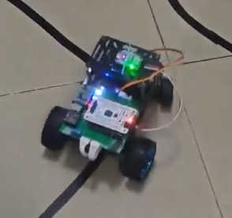

# 瞄点跟踪以及循迹小车

基于嘉立创天空星STM32的一套基本框架，包含了对循迹、步进电机驱动、激光控制的支持

<video controls src="方向控制.mp4" title="Title"></video>

<video controls src="阿克曼小车.mp4" title="Title"></video>

<video controls src="四轮驱动小车.mp4" title="Title"></video>

## 可以做成循迹小车

有速度和方向的pid算法，也支持阿克曼模型和四轮驱动模型，修改少量代码即可）

## 可以做成云台追踪光点

使用步进电机和舵机控制激光笔，使用k230或其他摄像头与STM32进行串口通信

## 使用多种外设

感为的循迹模块

maxicam视觉模块

陀螺仪

电机驱动

步进电机
